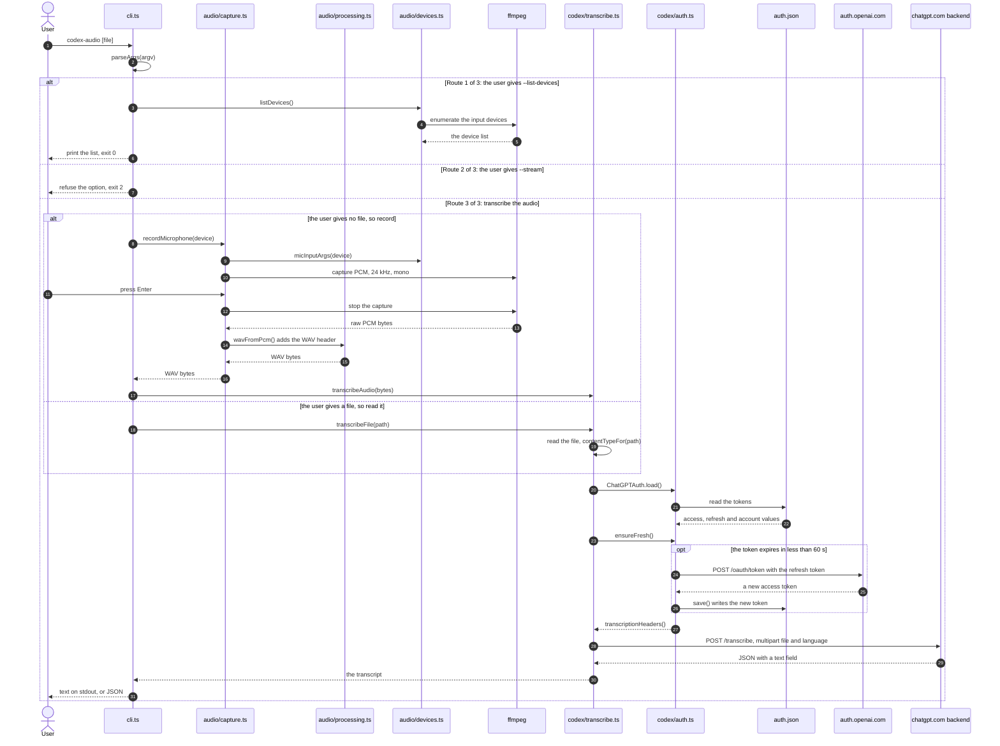
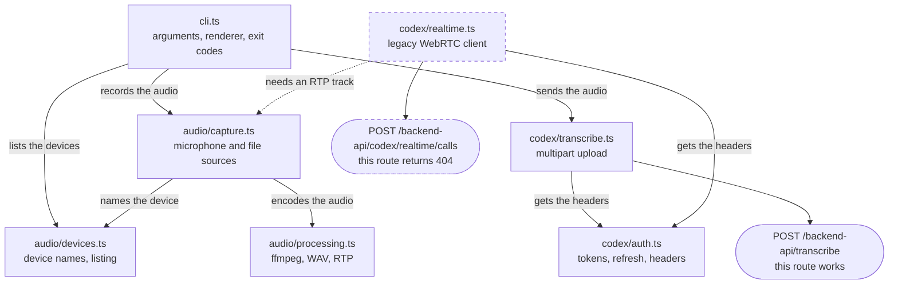

# How codex-audio works

`codex-audio` changes speech into text. It uses the ChatGPT credentials that
`codex login` writes to disk. It does not need an OpenAI API key.

## How to read the diagrams

The sequence diagram uses three labels from the sequence-diagram standard.
The text in brackets after each label gives the condition.

| Label | Meaning |
|---|---|
| `alt` and `else` | Alternative routes. Only one route runs. |
| `opt` | An optional step. It runs only if the condition is true. |
| The numbers | The order of the steps. |

## The upload path

This is the path the CLI uses. The diagram shows one run from start to end.
A run takes one of three routes. The third route does the transcription.

## Module map

Each module does one job. The realtime module is legacy code.

## Points to remember

- `cli.ts` never sends audio. `codex/transcribe.ts` sends it.
- `cli.ts` imports through `audio/index.ts` and `codex/index.ts`. Each
  folder gives one surface; the files behind it can move.
- `codex/auth.ts` refreshes the token 60 seconds before it expires. This
  prevents a failure in the middle of a session.
- ffmpeg does all the audio work: capture, WAV, Opus and the device listing.
  Nothing else touches the sound hardware.
- The microphone in the Codex Desktop composer uses the upload route. It does
  not use WebRTC.
- The realtime route returns 404. Keep `codex/realtime.ts` as a record of the
  older protocol.
